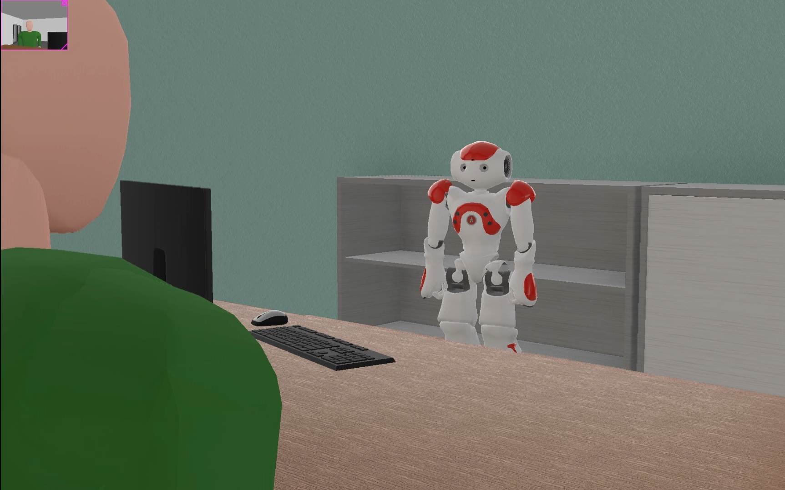

# <h1 align="center">NAOgest: Human-Gesture Execution System in Webots</h1>

**A Webots-based software system for generating and executing dynamic human gestures using the NAO humanoid robot.**

 

---

## Project Description

**NAOgest** enables realistic, expressive gesture execution by NAO robots in simulation using a modular, C-based architecture integrated with Webots simulated enviorement. This project aims to enhance non-verbal communication strategies in human-robot interactions.

---

## Table of Contents
- [Project Title and Overview](#project-title-and-overview)
- [Project Description](#project-description)
- [Features](#features)
- [Technology Stack](#technology-stack)
- [Demo and Preview](#demo-and-preview)
- [Installation](#installation)
- [Usage](#usage)
- [Configuration](#configuration)
- [Testing](#testing)
- [License](#license)
- [FAQs](#faqs)
- [Contact Information](#contact-information)

---

## Features

- 🎯 Modular gesture architecture using C controller in Webots.
- 🎥 Built simulation for gesture visualization.
- 🧠 Scenario-based gesture execution.
- 🔧 Easy to extend with custom gestures.

---

## Technology Stack

**Simulation & Robotics**:
- Webots
- NAO robot model
- Choregraphe

**Programming & Tools**:
- C

**Others**:
- Motion Fiels
- Custom World
- Webots supervisor/controller interface

---

## Demo and Preview

Here’s a snapshot of NAOgest in action:

- 🤖 NAO executes "greeting" and "pointing" gestures in Webots.
- 🔄 Scenario scripts define gesture sequences with delays and transitions.
- 🎬 Real-time animation synchronized with Webots simulation clock.
- 🎥 Demo Video

[](https://youtu.be/BPYxfBqmkpc?si=XXl-XrVqvyerRFt5)

---

## Installation

1. Clone the repository:
   ```bash
   git clone https://github.com/ThakkarVidhi/nao-gesture-hri.git
   cd nao-gesture-hri
   ```

2. Open Webots and load the provided project world file:
   - `worlds/nao-gesture-hri.wbt`

3. Run the simulation and observe the NAO robot executing gestures.

4. Ensure C controller is selected and configured in the Webots world.

---

## Usage

- Place gesture motions in `motions/` directory as `.motion` files.
- Use the provided Webots controller to run the scenario aftercompiling:
   ```bash
   controllers/nao_controller/nao_controller.c
   ```

- To test a specific gesture manually, invoke:
   ```c
   start_motion(motion_name)
   ```

---

## Configuration

Configuration is managed in `nao-gesture-hri.wbproj`.

---

## Testing

This project includes basic manual testing. To test the application:

- Launch the Webots simulator and load the ```nao-gesture-hri``` world file.

- Start the simulation and observe the NAO robot’s gesture-based actions in response to coded triggers.

- Manually test each scenario to verify that gestures are performed accurately and consistently.

- Monitor the simulation logs and console output for any unexpected behavior or execution errors.

---

## License

This project is licensed under the [MIT License](LICENSE).


---

## FAQs

**Q: What should I do if Webots fails to load the NAO robot correctly?**  
A: Ensure you have the latest version of Webots installed. Download the NAO model if prompted.

**Q: Can I use this project with a real NAO robot?**  
A: This is primarily designed for Webots simulation. Adapting to real hardware is possible but requires additional SDK integration.

**Q: How can I add custom gestures?**  
A: Add a new MOTION file in the `motions` directory and reference it in the controller to simulate the gesture.

---

## Contact Information

For questions or feedback:

- 📧 Email:  vidhithakkar.ca@gmail.com
- 💼 LinkedIn: [Vidhi Thakkar](https://www.linkedin.com/in/vidhi-thakkar-0b509724a/)
